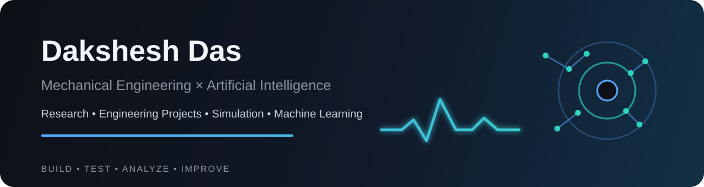

 

### Building at the intersection of mechanical systems, signal processing, and machine learning.

  
  
  

---

## About Me

I'm **Dakshesh Das**, a mechanical-engineering student interested in using data-driven methods to understand, monitor, and improve physical systems.

My work currently sits around **predictive maintenance, vibration-based condition monitoring, anomaly detection, signal processing, and intelligent mechanical systems**. I like projects where machine learning is tied to a real engineering question rather than treated as a black box.

**Research interests:** Predictive Maintenance · Reliability Engineering · Vibration Analysis · Fault Diagnosis · Intelligent Mechanical Systems · Thermal Management

---

## Featured Research

<table>
<tr>
<td width="58%" valign="top">

### [AI Predictive Maintenance for Rolling-Element Bearings](https://github.com/daksheshftw/AI-Predictive-Maintenance)

An end-to-end research project comparing conventional **RMS vibration thresholding** with machine-learning approaches for bearing fault detection and chronological early-anomaly warning.

**What I built**
- Vibration feature-engineering pipeline
- Leakage-aware leave-one-load-out validation
- Logistic Regression, Random Forest & XGBoost classifiers
- One-Class SVM, Isolation Forest & LOF anomaly detection
- CWRU fault-detection benchmark + NASA IMS run-to-failure analysis
- Reproducible notebooks, figures, result tables & research manuscript

[**Explore the repository →**](https://github.com/daksheshftw/AI-Predictive-Maintenance)

</td>
<td width="42%" valign="top">

</td>
</tr>
</table>

### Research Snapshot

| Experiment | Result |
|---|---:|
| CWRU binary Logistic Regression | **1.0000** mean-fold balanced accuracy |
| CWRU binary Random Forest | **1.0000** mean-fold balanced accuracy |
| CWRU multiclass Random Forest | **1.0000** mean balanced accuracy |
| IMS Test 2 One-Class SVM | **+4.33 h** anomaly lead vs RMS |
| IMS Test 2 sensitivity | Earlier in **9/12** settings; same in 3/12 |

Results are specific to the evaluated datasets and protocols. Early-anomaly lead is measured relative to the RMS alarm and is not an RUL prediction.

---

## Engineering + ML Toolkit

  
  
  
  
  
  
  
  
  

| Engineering | Data & ML | Research workflow |
|---|---|---|
| Vibration analysis | Supervised learning | Experimental design |
| Signal processing | Anomaly detection | Leakage-aware validation |
| Condition monitoring | Feature engineering | Sensitivity analysis |
| Reliability engineering | Model evaluation | Technical communication |

---

## What I'm Exploring

I'm especially interested in engineering problems where **physical behavior + sensor data + machine learning** can produce useful decisions: detecting degradation earlier, making maintenance more targeted, and designing mechanical systems that respond intelligently to changing conditions.

Areas I want to keep building in include **AI for predictive maintenance**, **advanced thermal-management systems**, and broader applications of machine learning in mechanical engineering.

---

### Selected Work

<a href="https://github.com/daksheshftw/AI-Predictive-Maintenance"><strong>AI Predictive Maintenance</strong></a>
&nbsp;·&nbsp;
<a href="https://github.com/daksheshftw/AI-Predictive-Maintenance/tree/main/paper"><strong>Research Manuscript</strong></a>
&nbsp;·&nbsp;
<a href="https://github.com/daksheshftw/AI-Predictive-Maintenance/tree/main/notebooks"><strong>Notebooks</strong></a>
&nbsp;·&nbsp;
<a href="https://github.com/daksheshftw/AI-Predictive-Maintenance/tree/main/results"><strong>Results</strong></a>

  

Mechanical Engineering × Artificial Intelligence

